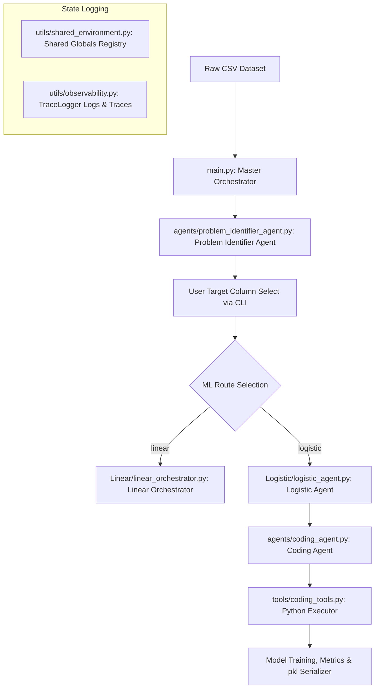

# ADEP2.0

An AI-driven pipeline system combining **Linear** and **Logistic** regression workflows, powered by intelligent agents and modular tooling. Built on top of the Google Agent Development Kit (ADK) and Gemini models, ADEP2.0 offers a highly flexible, self-healing, and agent-delegated data engineering and modeling environment.

---

## 🚀 Features

- **Automated Routing:** Analyzes raw datasets (CSVs) using a `ProblemIdentifierAgent` to determine target columns and route them to either Supervised (Linear/Logistic Regression) or Unsupervised workflows.
- **Agentic Delegation:** The `LogisticAgent` delegates code generation, imputation, and validation tasks dynamically to a universal `CodingAgent`, which writes, runs, and self-heals Python code in-memory.
- **Strict Preprocessing Operational Rules:**
  - *Retention Rule:* Prioritizes heavy imputation (medians/modes) to never drop more than 5% of rows.
  - *No-Truncation Rule:* Enforces loading 100% of the dataset; truncation (`.head()`, `nrows`) is strictly forbidden.
  - *Reality Rule:* Strictly processes actual dataframe loaded from CSV without using mock data.
  - *Feature Keep Rule:* Numeric columns are never dropped. Categorical columns are kept unless their cardinality exceeds 15 unique values.
- **Deterministic State Sharing:** Uses a thread-safe global environment registry (`SHARED_GLOBALS`) to preserve state across agents and execution runtimes.
- **Logging & Observability:** Uses a structured `TraceLogger` to capture system events, agent thoughts, and tool actions separately.

---

## 📁 Project Structure

```
ADEP2.0/
├── Linear/          # Linear pipeline modules (sequential EDA stages)
├── Logistic/        # Logistic pipeline modules (agentic delegation & preprocessing)
├── agents/          # AI agents for orchestration (ProblemIdentifierAgent, CodingAgent)
├── config/          # Configuration files
├── data/            # Dataset storage (raw and processed data)
├── test_logs/       # Logs from test runs
├── tests/           # Unit and integration test suite
├── tools/           # Utility tools (in-memory execution, package managers, logging)
├── utils/           # Helper functions (shared global state, environments)
├── main.py          # Master Orchestrator entry point
├── .env_example     # Environment variable template
├── ANTIGRAVITY.md   # Core Operating Directives for AI agents
├── SOUL.md          # Project philosophy, architectural notes, and progression log
└── requirements.txt # Python dependencies
```

---

## ⚙️ Setup

### 1. Clone the repository
```bash
git clone https://github.com/Allen203060/ADEP2.0.git
cd ADEP2.0
```

### 2. Install dependencies
```bash
pip install -r requirements.txt
```

### 3. Configure environment
Copy the template configuration and specify your API credentials and selected LLM model details:
```bash
cp .env_example .env
```

Open `.env` and fill in the active settings:
```ini
# Active settings
ADEP_PROVIDER=google  # Options: google, ollama, openrouter, nvidia
ADEP_MODEL_NAME=gemini-2.0-flash

# --- Providers Configuration (fill in the one you use) ---
GEMINI_API_KEY=your_gemini_api_key_here
OPENROUTER_API_KEY=your_openrouter_api_key_here
NVIDIA_API_KEY=your_nvidia_api_key_here
OLLAMA_API_BASE=http://localhost:11434
```

### 4. Run the application
Run the Master Orchestrator by pointing it to a raw dataset (defaults to `data/raw/raw_dataset.csv` if unspecified):
```bash
python main.py --file data/raw/raw_dataset.csv
```

---

## 🧬 System Architecture



---

## 🧪 Running Tests

The test suite covers state management, environment configurations, self-healing executors, and logger outputs.

You can run the tests using either `pytest` or Python's native `unittest` discovery runner:

**Using pytest:**
```bash
pytest tests/
```

**Using the custom test runner:**
```bash
python tests/run_tests.py
```

Test execution logs are dynamically written to the `test_logs/` directory.

---

## 👥 Contributors

- [Anvi-g](https://github.com/Anvi-g)
- [Allen203060](https://github.com/Allen203060)

---

## 📄 License

This project is currently unlicensed. See repository for more details.
